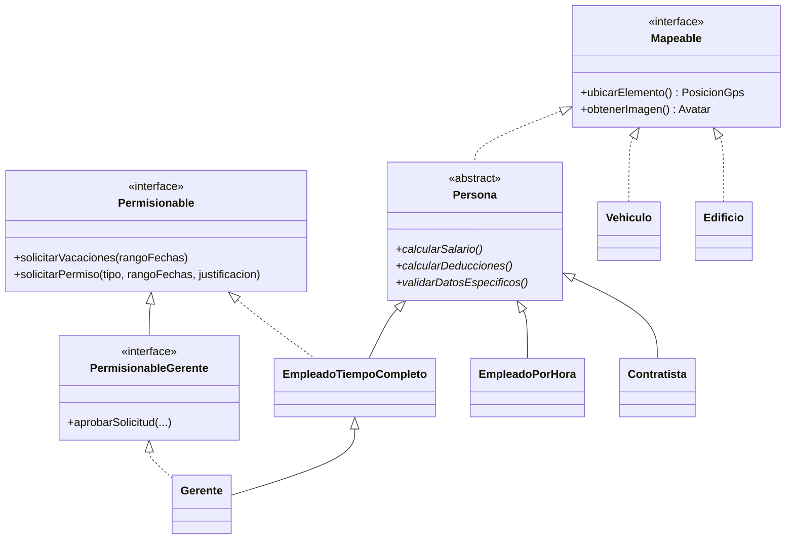

# Sistema de Gestión de Remuneraciones y RR. HH.

API REST para gestionar personal (empleados de tiempo completo, por hora, contratistas y gerentes), calcular nómina y validar reglas de negocio como las solicitudes de vacaciones. Construida con **Java 21** y **Spring Boot 3**.

> 🎓 **Proyecto académico** desarrollado como Trabajo Práctico de la materia *Lenguajes de Programación 3*. El foco estuvo en aplicar Programación Orientada a Objetos y diseño por capas sobre un caso de negocio realista.


---

## El proyecto incluye

- **Herencia y polimorfismo** en el dominio (`Persona` → empleados, gerentes, contratistas) y en las capas técnicas (controladores y mappers).
- **Interfaces como contratos transversales**: `Permisionable` (solicitar vacaciones/permisos) y `Mapeable` (geolocalización y avatar), implementada tanto por personas como por `Vehiculo` y `Edificio`.
- **Patrones de diseño**: *Template Method* en la jerarquía de mappers y un enfoque tipo *Strategy* en el cálculo de salarios y deducciones según el tipo de persona.
- **Manejo global de errores** con `@ControllerAdvice` y excepciones de negocio propias, que devuelven respuestas JSON consistentes.
- **Validaciones** con Bean Validation (sueldo mínimo legal, fecha de nacimiento en el pasado) y reglas de dominio.
- **Persistencia con JPA/Hibernate** (CRUD y carga por lotes) sobre H2.
- **DTOs y mappers** para desacoplar la API del modelo persistente.

## Stack

| Área | Tecnología |
|---|---|
| Lenguaje | Java 21 |
| Framework | Spring Boot 3.3.4 (Web, Data JPA, Validation) |
| Base de datos | H2 (modo archivo) |
| Build | Maven (incluye Maven Wrapper) |
| Otros | Lombok, SLF4J/Logback |

## Arquitectura

Paquete base: `py.edu.uc.lp32025`

```
controller/   Endpoints REST (jerarquía con BaseController)
service/      Lógica de negocio (RemuneracionesService, etc.)
repository/   Acceso a datos con Spring Data JPA
domain/       Entidades e interfaces del modelo
dto/          Objetos de transferencia y respuestas de error
mappers/      Conversión entidad <-> DTO (BaseMapper / AbstractBaseMapper)
exception/    Excepciones de negocio + GlobalExceptionHandler
utils/        NominaUtils, MapeableFactory, MapeableUtils
demo/         Demos de consola para Mapeable y Permisionable
```

### Modelo de dominio



## Reglas de negocio implementadas

- **Sueldo mínimo legal**: un empleado de tiempo completo no puede registrarse con salario inferior a 2.798.309 Gs.
- **Fecha de nacimiento** no puede ser futura (`FechaFuturaException`).
- **Vacaciones**: cada empleado de tiempo completo arranca con 30 días disponibles, que se descuentan al aprobarse una solicitud.
- **Límite por solicitud**: un empleado regular no puede pedir más de 20 días de una vez; los **gerentes** sí (`DiasInsuficientesException`).
- **Saldo insuficiente**: si se piden más días de los disponibles, la solicitud se rechaza.
- **Deducciones** distintas por tipo de persona (9 % para tiempo completo, 2 % para empleados por hora).

## Cómo ejecutarlo

### Requisitos

- Java 21
- Git

No hace falta instalar Maven: el proyecto incluye el wrapper (`mvnw`).

### Pasos

```bash
git clone https://github.com/<tu-usuario>/<nombre-del-repo>.git
cd <nombre-del-repo>

# Linux / macOS
./mvnw spring-boot:run

# Windows
mvnw.cmd spring-boot:run
```

La API queda disponible en `http://localhost:8080`.

### Base de datos (H2)

Por defecto la base se guarda en un archivo local, configurado en `src/main/resources/application.properties`:

```properties
spring.datasource.url=jdbc:h2:file:C:/data/lp32025db
```

- Consola H2: `http://localhost:8080/h2-console`
- Usuario: `sa` · Contraseña: `password` (credenciales locales de desarrollo)

## Endpoints principales

| Método | Ruta | Descripción |
|---|---|---|
| `POST` | `/api/gerentes` | Crear gerente |
| `POST` | `/api/empleados` | Crear empleado de tiempo completo |
| `POST` | `/api/empleados/batch` | Carga por lotes de empleados |
| `GET` | `/api/empleados/{id}/impuestos` | Cálculo de impuestos de un empleado |
| `POST` | `/api/empleados-por-hora` | Crear empleado por hora |
| `POST` | `/api/contratistas` | Crear contratista |
| `GET` | `/api/remuneraciones/empleados` | Nómina completa (lista polimórfica de DTOs) |
| `GET` | `/api/remuneraciones/total-remuneraciones` | Total de remuneraciones |
| `GET` | `/api/remuneraciones/empleados/tipo/{tipo}` | Filtrar por `tiempocompleto`, `porhora` o `contratista` |
| `GET` | `/api/remuneraciones/empleados/buscar?nombre=` | Buscar por nombre |
| `POST` | `/api/remuneraciones/empleados/{id}/solicitar-dias` | Solicitar vacaciones o permisos |

Los controladores `gerentes`, `empleados`, `empleados-por-hora`, `contratistas` y `personas` también exponen listado, consulta por ID y eliminación.

## Ejemplo de uso

**1. Crear un gerente**

```bash
curl -X POST http://localhost:8080/api/gerentes \
  -H "Content-Type: application/json" \
  -d '{
    "nombre": "Carlos",
    "apellido": "Jefe",
    "fechaNacimiento": "1980-05-20",
    "numeroDocumento": "10001",
    "numeroEmpleado": "G001",
    "salarioMensual": 15000000,
    "departamento": "Dirección",
    "nivelAutoridad": 5
  }'
```

**2. Crear un empleado de tiempo completo**

```bash
curl -X POST http://localhost:8080/api/empleados \
  -H "Content-Type: application/json" \
  -d '{
    "nombre": "Ana",
    "apellido": "Dev",
    "fechaNacimiento": "1995-08-15",
    "numeroDocumento": "20001",
    "numeroEmpleado": "E001",
    "salarioMensual": 6500000,
    "departamento": "IT"
  }'
```

**3. Listar la nómina completa**

```bash
curl http://localhost:8080/api/remuneraciones/empleados
```

**4. Solicitar vacaciones (válido, 15 días)**

```bash
curl -X POST "http://localhost:8080/api/remuneraciones/empleados/2/solicitar-dias?tipoSolicitud=VACACIONES&fechaInicio=2025-07-01&fechaFin=2025-07-15"
```

**5. Regla de negocio: más de 20 días para un empleado regular → error 400**

```bash
curl -X POST "http://localhost:8080/api/remuneraciones/empleados/2/solicitar-dias?tipoSolicitud=VACACIONES&fechaInicio=2025-08-01&fechaFin=2025-08-25"
```

**6. Empleado inexistente → error 404**

```bash
curl -X POST "http://localhost:8080/api/remuneraciones/empleados/999/solicitar-dias?tipoSolicitud=VACACIONES&fechaInicio=2025-01-01&fechaFin=2025-01-10"
```

> Los IDs asumen una base vacía, con el gerente creado primero (ID 1) y el empleado después (ID 2).

## Capturas de pruebas

Las pruebas manuales se hicieron con un cliente HTTP (Insomnia). Todas las capturas están en la carpeta [`Pruebas/`](Pruebas/).

| Nómina polimórfica | Cálculo de impuestos |
|---|---|
|  |  |

| Solicitud válida de vacaciones | Error por días excedidos |
|---|---|
|  |  |

| Privilegio de gerente | Empleado inexistente |
|---|---|
|  |  |

## Limitaciones y posibles mejoras

Al ser un trabajo académico, hay cosas que dejé fuera del alcance y que mejorarían el proyecto:

- Tests automatizados: hoy solo existe el test de carga de contexto de Spring; las pruebas fueron manuales.
- Autenticación y autorización (los "permisos" del dominio son reglas de negocio, no seguridad HTTP).
- Documentación de la API con OpenAPI/Swagger.
- Base de datos configurable por perfiles (H2 en desarrollo, PostgreSQL en producción) y variables de entorno para las credenciales.
- Persistir el detalle de cada solicitud de vacaciones; actualmente solo se descuenta el saldo del empleado.

## Autor

**Sebastián Laguardia** · [GitHub](https://github.com/laguardiia) · [LinkedIn](https://www.linkedin.com/in/sebasti%C3%A1n-laguardia-300237369/)
